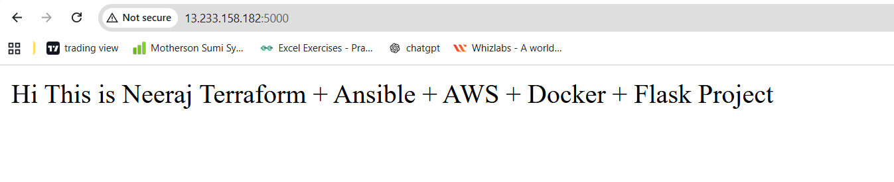
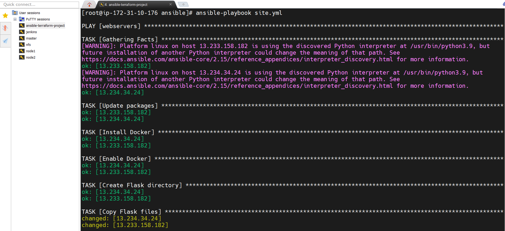
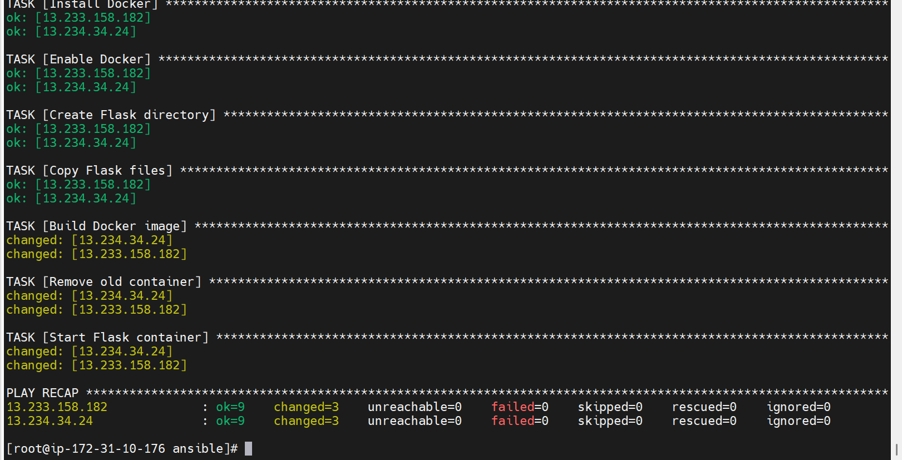
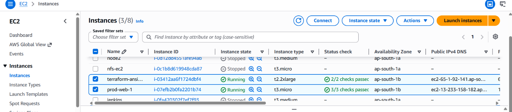
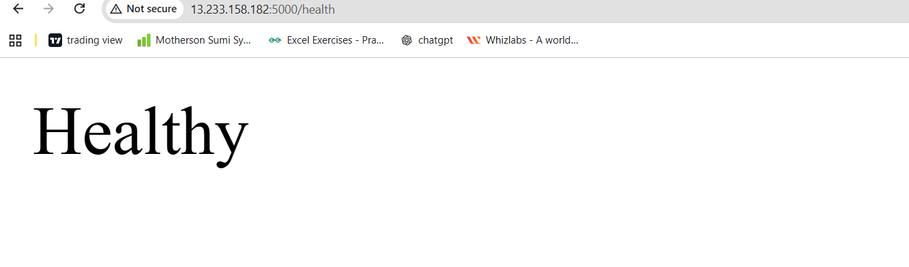
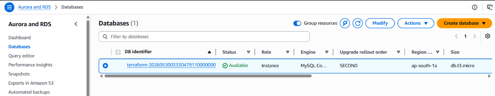
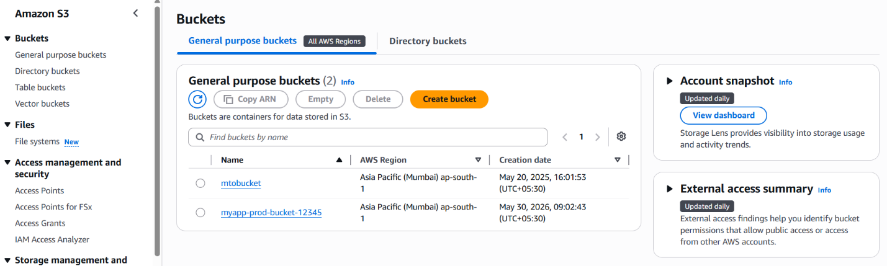
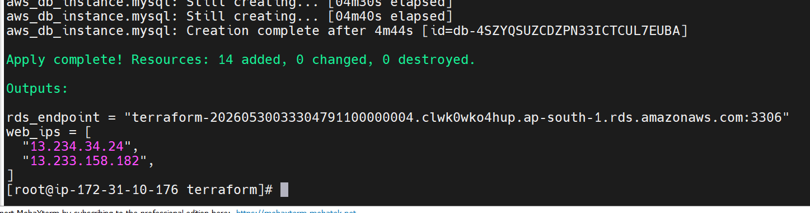
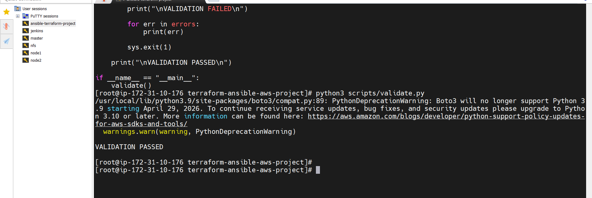

# End-to-End AWS Infrastructure Automation using Terraform, Ansible, Docker, Flask & Python Validation

## Project Overview

This project demonstrates an end-to-end DevOps automation workflow using AWS, Terraform, Ansible, Docker, Flask, and Python.
The infrastructure is provisioned using Terraform, application deployment is automated using Ansible, the application is containerized with Docker, and infrastructure validation is performed using Python and Boto3.
________________________________________
## Architecture

Developer

   |
   v
   
Terraform

   |
   +--> VPC
   
   +--> Public Subnets
   
   +--> Security Group
   
   +--> EC2 Instances (2)
   
   +--> S3 Bucket
   
   +--> RDS MySQL
   |
   
   v
Generate Inventory Script

   |
   v
   
Ansible

   |
   +--> Install Docker
   
   +--> Copy Flask Code
   
   +--> Build Docker Image
   
   +--> Run Container
   
   |
   
   v
   
Flask Application

   |
   +--> /
   
   +--> /health
   
   |
   
   v
   
Python Validation Script

________________________________________
 
 ## Technologies Used
 
•	AWS EC2

•	AWS VPC

•	AWS S3

•	AWS RDS (MySQL)

•	Terraform

•	Ansible

•	Docker

•	Python

•	Flask

•	Boto3

•	Linux (Amazon Linux 2023)

•	Git & GitHub
________________________________________

## Project Structure

terraform-ansible-aws-project/

│

├── .gitignore

│

├── terraform/

│   ├── provider.tf

│   ├── variables.tf

│   ├── terraform.tfvars

│   ├── vpc.tf

│   ├── security.tf

│   ├── ec2.tf

│   ├── s3.tf

│   ├── rds.tf

│   ├── outputs.tf

│   └── userdata.sh

│

├── ansible/

│   ├── ansible.cfg

│   ├── inventory.ini

│   ├── site.yml

│

│

│   ├── files/

│   │   └── flask-app/

│   │       ├── app.py

│   │       ├── Dockerfile

│   │       └── requirements.txt

│

├── scripts/

│   ├── generate_inventory.sh

│   └── validate.py

│

└── screenshots/

    ├── terraform-apply.png
    
    ├── ec2-running.png
    
    ├── ansible-success.png
    
    ├── docker-running.png
    
    ├── flask-app.png
    
    └── validation-pass.png
    
________________________________________

 
## Project Objectives
 
•	Provision AWS infrastructure using Terraform.

•	Create a custom VPC and networking components.

•	Deploy two EC2 instances automatically.

•	Create an S3 bucket for storage.

•	Create an RDS MySQL database.

•	Generate Ansible inventory dynamically.

•	Install Docker using Ansible.

•	Deploy a Flask application inside Docker containers.

•	Validate infrastructure health using Python automation.

________________________________________
 
## Infrastructure Provisioned

Terraform Resources

•	VPC

•	Internet Gateway

•	Route Table

•	Public Subnets

•	Security Groups

•	EC2 Instances (2)

•	S3 Bucket

•	RDS MySQL Database

________________________________________

Flask Application

Endpoints

Home Page
GET /
Response:

Hi This is Neeraj Terraform + Ansible + AWS + Docker + Flask Project

Health Check
GET /health
Response:
Healthy
________________________________________

## Deployment Workflow

Step 1: Configure AWS CLI

aws configure

Provide:

AWS Access Key

AWS Secret Access Key

Region: ap-south-1

Output: json

________________________________________

Step 2: Deploy Infrastructure

cd terraform

terraform init

terraform validate

terraform plan

terraform apply -auto-approve
________________________________________

Step 3: Generate Dynamic Inventory

cd ..

chmod +x scripts/generate_inventory.sh

./scripts/generate_inventory.sh

________________________________________

Step 4: Verify Ansible Connectivity

cd ansible

ansible webservers -m ping

________________________________________

Step 5: Deploy Application

ansible-playbook site.yml

Tasks performed:

•	OS package updates

•	Docker installation

•	Docker service enablement

•	Flask code deployment

•	Docker image build

•	Container deployment

________________________________________

Step 6: Access Application

http://<EC2-Public-IP>:5000

Health Endpoint:

http://<EC2-Public-IP>:5000/health

________________________________________

Step 7: Validate Infrastructure

Install dependencies:

pip install boto3 requests

Run validation:

python3 scripts/validate.py

Expected output:

VALIDATION PASSED

________________________________________

✅ Validation Checks

The Python validation script verifies:

EC2 Validation

•	At least 2 EC2 instances are running.

S3 Validation

•	Target S3 bucket exists.

RDS Validation

•	MySQL RDS instanc
e exists.

Application Validation

•	Flask Health Endpoint returns:

Healthy

________________________________________

## Project Screenshots:

## Brower-output

## Ansible-apply

## Ansible-playbook

## Aws-ec2-instance

## Healthy

## Mysql-database

## S3-bucket

## Terraform-apply

## Validation.py

# Author

## Neeraj Kumar

## DevOps | Cloud | AWS | Terraform | Ansible | Docker | Kubernetes

## GitHub: https://github.com/mtotech

## LinkedIn: www.linkedin.com/in/neeraj-kumar-iaf

______________________________

